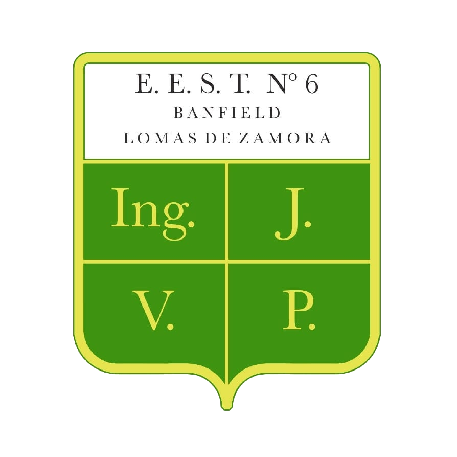

# 🔍 Escáner de Plásticos - E.E.S.T. N°6 Lomas de Zamora

Una aplicación web educativa desarrollada por estudiantes de la **E.E.S.T. N°6 de Lomas de Zamora** para identificar códigos de reciclaje de plásticos y conocer sus características de seguridad.

## 📋 Descripción

Esta aplicación permite a los usuarios escanear códigos de reciclaje de envases plásticos (tupperware, botellas, etc.) y obtener información detallada sobre:

- ✅ **Seguridad para microondas**
- 🔬 **Características del material**
- ♻️ **Información de reciclaje**
- ⚠️ **Notas de seguridad**
- 🏭 **Usos comunes**

## 🚀 Características

- **Escáner con cámara**: Utiliza la cámara del dispositivo para identificar códigos
- **Base de datos completa**: Información de los 7 tipos de plásticos más comunes
- **Interfaz intuitiva**: Diseño responsive y fácil de usar
- **Indicadores visuales**: Alertas claras sobre seguridad para microondas
- **Información educativa**: Detalles técnicos y de seguridad

## 🛠️ Tecnologías Utilizadas

- **Next.js 14** - Framework de React
- **TypeScript** - Tipado estático
- **Tailwind CSS** - Estilos
- **shadcn/ui** - Componentes de UI
- **Lucide React** - Iconos

## 📱 Códigos de Plástico Soportados

| Código | Tipo | Microondas | Ejemplos |
|--------|------|------------|----------|
| 1 | PET | ❌ No | Botellas de agua, refrescos |
| 2 | HDPE | ❌ No | Botellas de leche, detergente |
| 3 | PVC | ❌ No | Tuberías, envases de aceite |
| 4 | LDPE | ❌ No | Bolsas plásticas, film |
| 5 | PP | ✅ Sí | Tupperware, tapas, pajitas |
| 6 | PS | ❌ No | Vasos desechables, bandejas |
| 7 | Otros | ⚠️ Verificar | Policarbonato, mezclas |

## 🏃‍♂️ Instalación y Uso

### Prerrequisitos

- Node.js 18+ 
- npm o yarn

### Instalación

1. Clona el repositorio:
\`\`\`bash
git clone https://github.com/tu-usuario/escaner-plasticos-eest6.git
cd escaner-plasticos-eest6
\`\`\`

2. Instala las dependencias:
\`\`\`bash
npm install
# o
yarn install
\`\`\`

3. Ejecuta el servidor de desarrollo:
\`\`\`bash
npm run dev
# o
yarn dev
\`\`\`

4. Abre [http://localhost:3000](http://localhost:3000) en tu navegador.

## 📖 Cómo Usar la Aplicación

1. **Busca el código**: Localiza el símbolo de reciclaje en tu envase (triángulo con número)
2. **Escanea**: Haz clic en "Iniciar Cámara" y enfoca el código
3. **Obtén información**: Recibe detalles completos sobre el tipo de plástico y su seguridad

## 🏫 Sobre la Institución

**E.E.S.T. N°6 "Banfield"**  
Lomas de Zamora, Buenos Aires, Argentina

Esta aplicación fue desarrollada como proyecto educativo para concientizar sobre el uso seguro de plásticos y promover el reciclaje responsable.

## 🤝 Contribuir

Las contribuciones son bienvenidas. Para cambios importantes:

1. Fork el proyecto
2. Crea una rama para tu feature (`git checkout -b feature/AmazingFeature`)
3. Commit tus cambios (`git commit -m 'Add some AmazingFeature'`)
4. Push a la rama (`git push origin feature/AmazingFeature`)
5. Abre un Pull Request

## 📄 Licencia

Este proyecto está bajo la Licencia MIT. Ver el archivo `LICENSE` para más detalles.

## 👥 Créditos

Desarrollado por estudiantes de la E.E.S.T. N°6 de Lomas de Zamora como parte de un proyecto educativo sobre sustentabilidad y tecnología.

## 📞 Contacto

E.E.S.T. N°6 "Banfield"  
Lomas de Zamora, Buenos Aires  
Argentina

---

⭐ Si este proyecto te resulta útil, ¡dale una estrella en GitHub!
